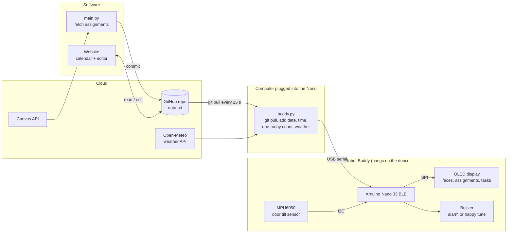

```mermaid
flowchart LR
    subgraph Cloud
        Canvas["Canvas API"]
        Weather["Open-Meteo<br/>weather API"]
        Repo[("GitHub repo<br/>data.txt")]
    end

    subgraph Software
        Main["main.py<br/>fetch assignments"]
        Site["Website<br/>calendar + editor"]
    end

    subgraph PC["Computer plugged into the Nano"]
        Buddy["buddy.py<br/>git pull, add date, time,<br/>due-today count, weather"]
    end

    subgraph Device["Robot Buddy (hangs on the door)"]
        Nano["Arduino Nano 33 BLE"]
        IMU["MPU6050<br/>door tilt sensor"]
        OLED["OLED display<br/>faces, assignments, tasks"]
        Buzzer["Buzzer<br/>alarm or happy tune"]
    end

    Canvas --> Main
    Main -->|"commit"| Repo
    Site <-->|"read / edit"| Repo
    Repo -->|"git pull every 15 s"| Buddy
    Weather --> Buddy
    Buddy -->|"USB serial"| Nano
    IMU -->|"I2C"| Nano
    Nano -->|"SPI"| OLED
    Nano --> Buzzer
```
