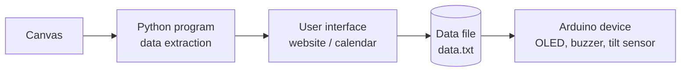

## How it works

### Main Components

1. **Canvas Data:** `main.py` pulls assignments from Canvas using a Canvas API token.
2. **Website:** The calendar style user interface where assignments and tasks can be added and checked off.
3. **Device:** the Arduino Nano 33 BLE hangs on the door. An MPU6050 sensor detects when the door swings open, an OLED displays the info, and a buzzer plays sound.
